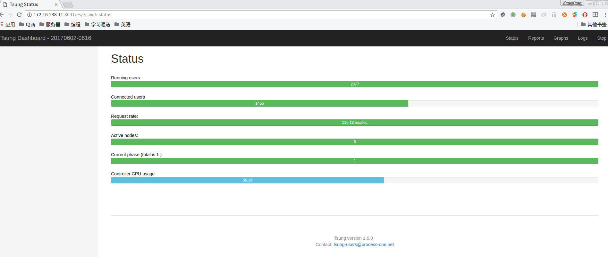

### docker to run multi tsung container


```bash
sudo su
eval $(ssh-agent)
ssh-add ~/.ssh/id_rsa
git clone project  tsung
cd tsung
docker-compose up -d
ssh 172.16.238.11
ssh tsung-2 and exit
ssh tsung-3 and exit
cd /data/www/wwwroot
tsung -f tsung start
```

open [web monitor](http://172.16.238.11:8091) to see the status


### ref
[ssh_agent](https://segmentfault.com/a/1190000002449006)


